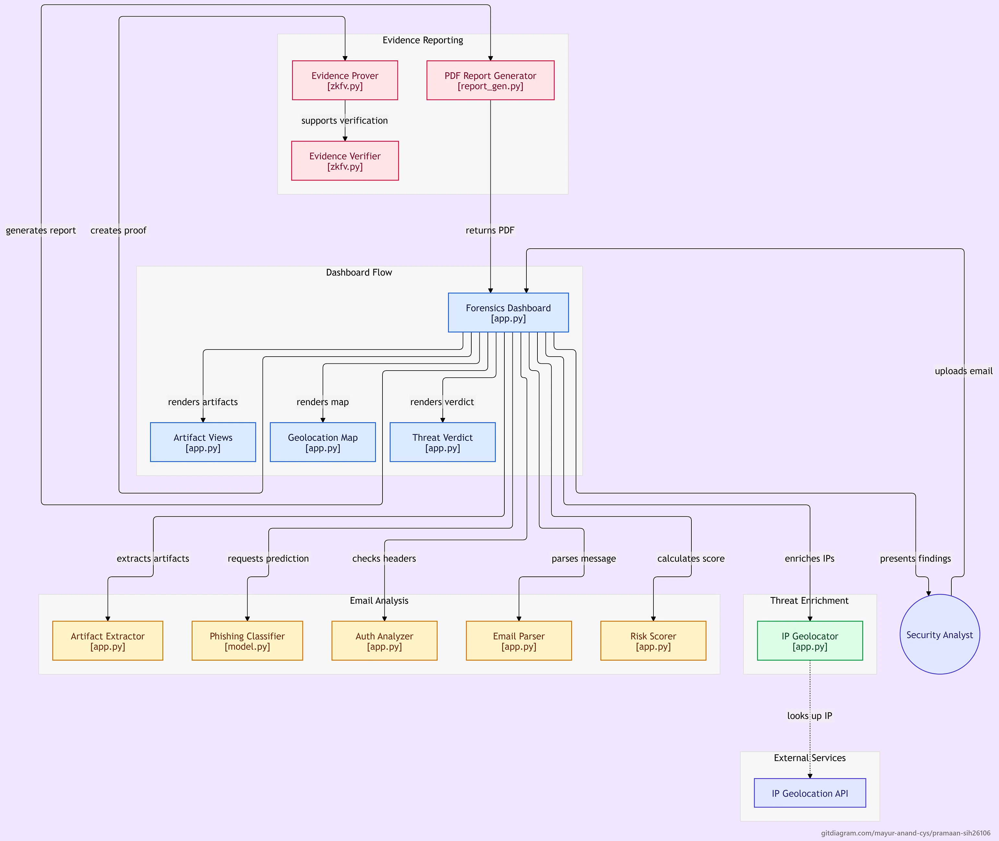
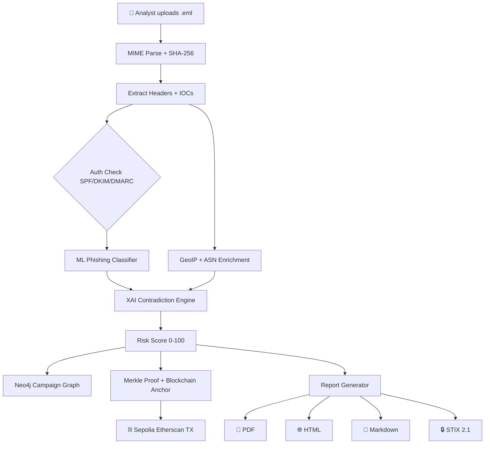

# 🛡️ PRAMAAN


### AI-Powered Email Threat Detection, Geolocation & Forensic Intelligence Platform

> **Detect the Threat. Trace the Infrastructure. Preserve the Evidence.**


**Problem Statement:** SIH26106 · Blockchain & Cybersecurity  
**Organization:** AICTE Cyber Security Cell  
**Team:** Team Apex (6 members)  
**Live Sepolia Contract:** [`0x87f8CD4c4628D77aCDfb76Ee6428Fa98dc2dEed8`](https://sepolia.etherscan.io/address/0x87f8CD4c4628D77aCDfb76Ee6428Fa98dc2dEed8)

---

## What is PRAMAAN?

Traditional email filters **block** threats. They don't **explain** them, **trace** them, or **prove** they happened.

PRAMAAN is an explainable, forensic-grade email threat investigation platform. It ingests a suspicious `.eml` file, runs a deterministic analysis pipeline, and produces:

- A **threat score** with a transparent factor breakdown (no black-box verdicts)
- A **geolocation map** of the attacker's infrastructure (IP, ASN, ISP, country)
- A **Neo4j campaign correlation graph** linking related emails by shared infrastructure
- **Blockchain-anchored forensic evidence** (Sepolia testnet + Merkle proof)
- A **court-ready multi-format report** (PDF, HTML, Markdown, STIX 2.1)

> **The gap PRAMAAN closes: Detection ≠ Investigation.**

---

## Feature Status

Every feature below is tagged honestly:

- ✅ **Shipped** — merged to main, working today
- 🟡 **Wired** — module exists but not yet called from the API
- 🔵 **In PR** — code complete on a branch, pending review
- ⏳ **Roadmap** — planned, not yet written

| Feature | Status | Notes |
|---------|--------|-------|
| ML phishing classifier (TF-IDF + LogisticRegression) | ✅ Shipped | `model.py` |
| XAI Contradiction Detection engine | ✅ Shipped | `xai_engine.py` |
| SPF / DKIM / DMARC / ARC header parsing | ✅ Shipped | `api.py` |
| Typosquat & homoglyph detection | ✅ Shipped | `backend/typosquat/` |
| RDAP fresh-domain lookup | ✅ Shipped | `backend/typosquat/rdap_lookup.py` |
| Parallel GeoIP + ASN enrichment | ✅ Shipped | `threat_intel.py` |
| NetworkX threat infrastructure graph | ✅ Shipped | `graph_engine.py` |
| Neo4j persistent campaign correlation | ✅ Shipped | `neo4j_engine.py` |
| SHA-256 + Merkle tree evidence proof | ✅ Shipped | `zkfv.py` |
| Solidity smart contract on Ethereum Sepolia | ✅ Shipped | `blockchain/contracts/PramaanEvidence.sol` |
| Multi-format reporting (PDF / HTML / MD / STIX 2.1) | ✅ Shipped | `report_*.py` |
| Security hardening (zip bombs, MIME recursion, prompt injection) | ✅ Shipped | `security_hardening.py` |
| PII masking for DPDP Act 2023 | ✅ Shipped | `backend/reporting/pii_mask.py` |
| Chain-of-custody PDF with page numbers | ✅ Shipped | `report_gen.py` |
| Live threat intel feeds (VirusTotal, AbuseIPDB, Shodan, etc.) | ✅ Shipped | `backend/intel/` |
| OAuth 2.0 live inbox firewall (M365, Gmail) | ⏳ Roadmap | Grand Finale target |
| Hyperledger Fabric dual-anchor | ⏳ Roadmap | Enterprise pilot phase |

---

## System Architecture



### End-to-End Processing Pipeline



---

## Geolocation Inference Cascade

To handle the industry-wide problem where webmail clients (Gmail, Outlook) strip client IPs from headers, PRAMAAN implements a **multi-tier fallback** to locate the sender's origin:

| Tier | Forensic Indicator | Example | Reliability |
|------|--------------------|---------|-----------|
| 1 | Direct source IP from Received-SPF | `client-ip=103.108.118.85` | High |
| 2 | Domain mail infrastructure (MX DNS) | `@ippbonline.co.in` → MX IP | High |
| 3 | Client machine clock offset | `Date: ... +0530` | Medium |
| 4 | ccTLD sovereign jurisdiction | `.in`, `.gov.in`, `.ru` | Medium |
| 5 | Regional webmail provider | `rediffmail.com` → Mumbai | Medium |
| 6 | Indic script & entity corroboration | Devanagari, ₹ / INR, RBI | Low-Medium |
| 7 | Global mail hub baseline | Provider global infrastructure | Low |

---


## Tech Stack

| Layer | Technologies |
|-------|-------------|
| **Backend** | Python 3.10+, FastAPI, Uvicorn, Pydantic v2 |
| **Frontend** | Streamlit, Plotly, Altair |
| **ML / NLP** | scikit-learn (TF-IDF + Logistic Regression), RapidFuzz |
| **Auth / DNS** | dnspython, pyspf, dkimpy |
| **Threat Intel** | ip-api.com (GeoIP + ASN), RDAP, VirusTotal, AbuseIPDB, Shodan |
| **Graph** | Neo4j 5.x, NetworkX |
| **Blockchain** | Web3.py, Solidity `PramaanEvidence.sol`, Ethereum Sepolia |
| **Reports** | ReportLab (PDF), HTML, Markdown, STIX 2.1 |
| **Storage** | SQLite (evidence ledger), Neo4j (campaign graph) |
| **Deployment** | Docker, docker-compose |

---

## Quick Start

### Prerequisites

- Python 3.10+
- Git
- Docker (for Neo4j)

### 1. Clone and set up

```bash
git clone https://github.com/mayur-anand-cys/pramaan-sih26106.git
cd pramaan-sih26106
python -m venv .venv
source .venv/Scripts/activate      # Windows Git Bash
# source .venv/bin/activate         # Linux / macOS
pip install -r requirements.txt
```

### 2. Start Neo4j

```bash
docker-compose up neo4j -d
```

Neo4j runs at `bolt://localhost:7687`. Default credentials: `neo4j` / `pramaan_dev`.

### 3. Start the dashboard

```bash
streamlit run app.py
```

Opens at `http://localhost:8501`. Upload any `.eml` file → analysis runs → PDF report downloads.

### 4. (Optional) Start the API

```bash
uvicorn api:app --reload --port 8000
```

API docs at `http://localhost:8000/docs`.

---

## Environment Configuration

Copy `.env.example` to `.env` and fill in optional keys. All keys are **optional** — missing keys degrade gracefully.

```bash
# Neo4j
NEO4J_URI=bolt://localhost:7687
NEO4J_USER=neo4j
NEO4J_PASSWORD=pramaan_dev

# Threat Intel Feeds (all optional)
VIRUSTOTAL_API_KEY=
ABUSEIPDB_API_KEY=
IPINFO_TOKEN=
URLSCAN_API_KEY=
GOOGLE_SAFE_BROWSING_API_KEY=
SHODAN_API_KEY=
CENSYS_API_ID=
CENSYS_API_SECRET=

# Redis cache (optional - falls back to in-memory)
REDIS_URL=redis://localhost:6379/0
```

---

## Testing

Run the full test suite:

```bash
pytest tests -q
```

**Current test coverage:**

- `test_auth_check.py` — SPF / DKIM / DMARC parsing
- `test_intel_aggregator.py` — Threat intel aggregation
- `test_thread_hijack.py` — Thread hijack detection
- `test_typosquat.py` — Brand lookalike detection
- `test_xai.py` — XAI contradiction engine

---

## Repository Structure

```
pramaan-sih26106/
├── app.py                       # Streamlit UI
├── api.py                       # FastAPI backend
├── model.py                     # ML phishing classifier
├── threat_intel.py              # GeoIP + ASN enrichment
├── graph_engine.py              # NetworkX infrastructure graph
├── neo4j_engine.py              # Neo4j campaign correlation
├── xai_engine.py                # XAI contradiction detection
├── zkfv.py                      # Merkle proof generation
├── report_gen.py                # PDF report generator
├── report_canvas.py             # NumberedCanvas (Page X of Y)
├── report_html.py               # HTML export
├── report_markdown.py           # Markdown export
├── report_stix.py               # STIX 2.1 export
├── security_hardening.py        # Defense modules
├── blockchain/                  # Smart contracts + anchoring
│   ├── anchor.py
│   ├── merkle.py
│   └── contracts/PramaanEvidence.sol
├── backend/
│   ├── auth/                    # PBKDF2 login + SQLite user DB
│   ├── detection/               # Thread hijack detection
│   ├── intel/                   # Threat intel aggregator
│   ├── reporting/pii_mask.py    # DPDP Act PII masking
│   └── typosquat/               # Brand lookalike detection
├── tests/                       # Pytest suite
├── docs/                        # PRD + architecture
├── pramaan/                     # CLI + citizen view
└── requirements.txt
```

---

## Team Apex

| Role | Name | GitHub |
|------|------|--------|
| Team Lead | Sudarshan Iyengar | [@sudarshaniyengar324-cloud](https://github.com/sudarshaniyengar324-cloud) |
| Tech Lead | Mayur Anand | [@mayur-anand-cys](https://github.com/mayur-anand-cys) |
| Member | Shreya Garje | [@shreyagarje07-star](https://github.com/shreyagarje07-star) |
| Member | Keerthana C | [@keerthanac0905](https://github.com/keerthanac0905) |
| Member | Sneha Namratha | [@snehanamratha](https://github.com/snehanamratha) |
| Member | Charitha Sri Reddy | [@charithasrireddy](https://github.com/charithasrireddy) |

**Institute / College:** Vemana Institute of Technology, Bengaluru  
**Team ID:** SIH26106-Apex

---

## Compliance

PRAMAAN is designed for deployment within Indian government and law enforcement contexts. Each module maps to a specific legal or regulatory obligation.

### DPDP Act 2023 — Digital Personal Data Protection

**Module:** `backend/reporting/pii_mask.py`

- **Data Minimization (Section 6):** PII is masked in all exported reports — email local parts, phone numbers, Aadhaar, and PAN are redacted before they leave the platform.
- **Storage Limitation (Section 8(7)):** Configurable retention windows on raw `.eml` evidence. Default: 90 days.
- **Purpose Limitation:** Analysis is scoped to threat investigation only; no secondary use of email content.
- **Breach Notification (Section 8(6)):** Alerting hook prepared for Data Protection Board reporting.
- **DPDP Rules 2025 (notified 14 Nov 2025):** 18-month phased compliance timeline tracked in `docs/DEPLOYMENT_PLAN.md`.

### CERT-In Directions 2022 — Incident Reporting

**Module:** `backend/intel/`, `scripts/`

- **6-Hour Reporting:** Webhook pipeline prepared to push indicators to CERT-In within the mandated 6-hour window (`docs/DEPLOYMENT_PLAN.md`, Month 5).
- **Log Retention (180 Days):** All analysis events stored in `zkfv_ledger.db` with timestamps. Configurable retention extends to 180+ days.
- **NTP Synchronization:** On-chain timestamps sourced from block time on Sepolia; local audit timestamps align to NPL via system NTP.
- **Point of Contact:** Designated in `SECURITY.md` — reported via the private vulnerability reporting channel.

### Bharatiya Sakshya Adhiniyam 2023 — Electronic Evidence

**Module:** `zkfv.py`, `blockchain/anchor.py`, `report_gen.py`

- **Section 63(4) — Certificate:** Every forensic PDF includes a chain-of-custody manifest with SHA-256 hash, Merkle root, and analyst attestation. Structured to accept a Section 63(4) certificate in future releases.
- **Hash Integrity:** Raw `.eml` bytes are hashed at ingestion. Any modification changes the Merkle root and invalidates the on-chain anchor.
- **Admissibility:** Metadata-only evidence design — no raw email content on-chain, preserving both privacy and evidentiary integrity.

### IT Act 2000 (as amended 2023)

**Module:** `security_hardening.py`, `backend/auth/`

- **Section 43:** Defenses against unauthorized access — PBKDF2 password hashing, session isolation, rate limiting.
- **Section 66:** Anomaly detection surfaces compromised credentials and account takeover indicators.
- **Section 69:** API endpoints prepared for lawful interception hooks (roadmap; gated behind ministerial authorization).

### Additional Alignments

| Framework | Alignment |
|---|---|
| NIST Cybersecurity Framework 2.0 | Detection (DE), Analysis (AN) categories mapped to pipeline stages |
| ISO/IEC 27037:2012 | Digital evidence handling — identification, collection, acquisition, preservation |
| RFC 5322 / 5321 | MIME and SMTP parsing compliance |
| DKIM / SPF / DMARC (RFC 6376, 7208, 7489) | Full authentication chain validation |

### Roadmap Compliance Items

- Section 63(4) certificate generator (Month 2, post-SIH)
- CERT-In empanelment for audit readiness (Month 3)
- DPDP Rules 2025 — full SDF (Significant Data Fiduciary) readiness (Month 6)


---

## License

MIT License — see [LICENSE](LICENSE) for details.

---

## Project Documentation

- [Product Requirements Document](docs/PRD.md)
- [Deployment Plan (6-month post-SIH)](docs/DEPLOYMENT_PLAN.md)
- [Intellectual Property Notice](IP_NOTICE.md)
- [Contributing Guide](CONTRIBUTING.md)
- [Code of Conduct](CODE_OF_CONDUCT.md)
- [Security Policy](SECURITY.md)

## DEMO_MODE

Set `PRAMAAN_DEMO_MODE=true` to run the dashboard in offline demo mode. When
enabled, IP geolocation calls to `ip-api.com` are bypassed and pre-computed
fixtures from `backend/demo/fixtures_geo.json` are returned instead.

Use this for:
- Offline demos (no network dependency)
- Deterministic results for presentations
- Avoiding rate limits on the free `ip-api.com` tier

Example (Windows CMD):
    set PRAMAAN_DEMO_MODE=true && streamlit run app.py

Example (bash):
    PRAMAAN_DEMO_MODE=true streamlit run app.py

When disabled (default), the app uses the live `ip-api.com` API.